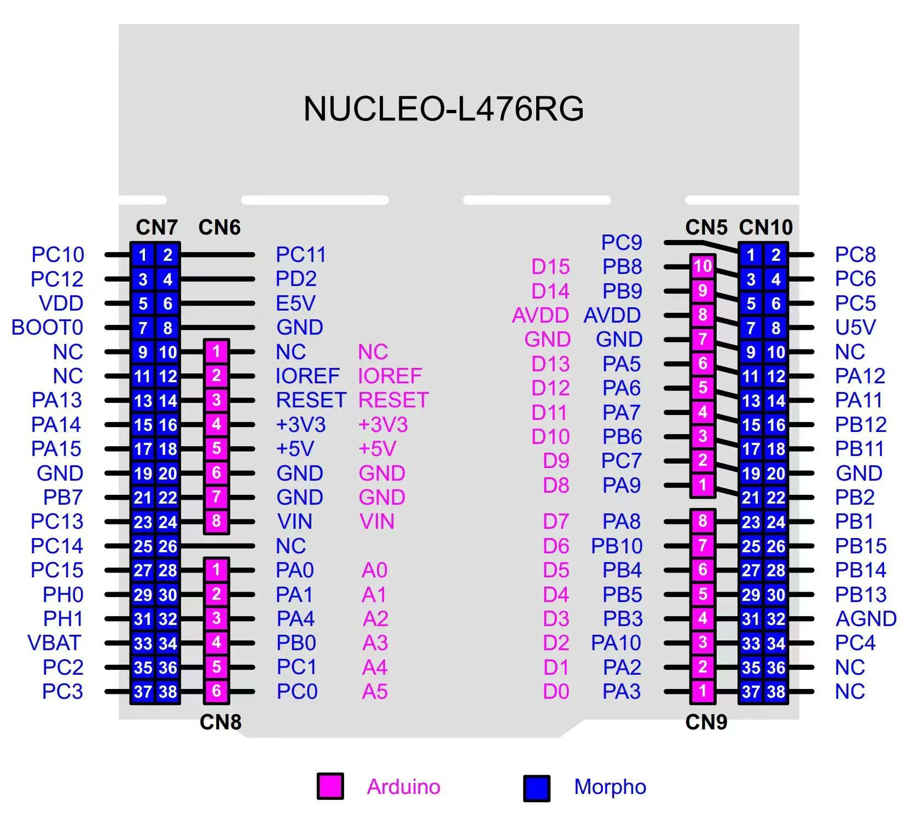
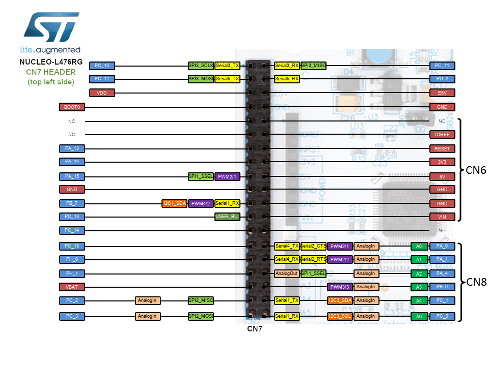
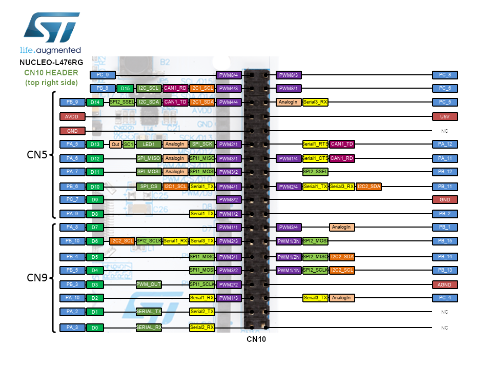

# 认识NUCLEO-L476RG开发板

这块开发板自带 **ST-LINK 调试器**，可以使用 **Mini-USB** 数据线连接到电脑。

如果连接电脑之后无法识别，请[下载驱动](https://www.st.com/en/development-tools/stsw-link009.html)并安装。

B1 - PC13  
LD2 - PA5

::: details NUCLEO-L476RG的引脚定义图

左侧Arduino Pin

右侧Arduino Pin

左侧Morpho Pin

右侧Morpho Pin

:::

NUCLEO-L476RG 的 Arduino Pin 和 UNO R3 一致，是外侧 Morpho 引脚的子集，它们可以兼容 Arduino 的 Shield 扩展板。

Morpho 引脚则提供 STM32 的完整功能，**包含了内侧 Arduino 引脚的所有功能**。如果你要使用所有资源，推荐使用 Morpho 引脚。