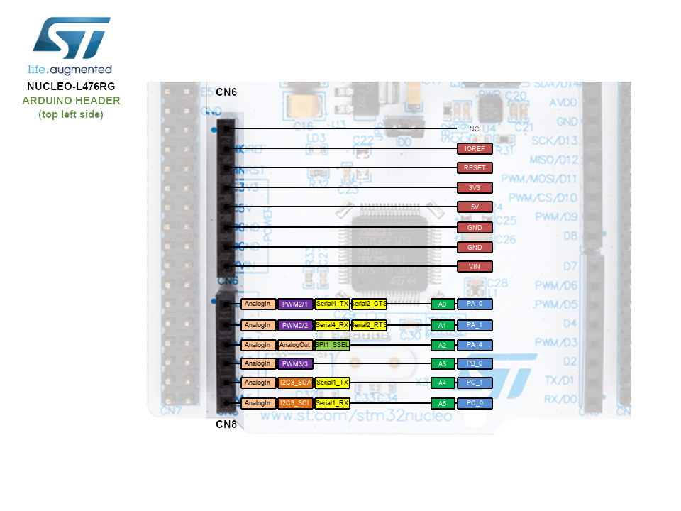

# 参考资料
 > *工欲善其事，必先利其器。*

这里是一些常用的参考资料。

- [STM32L476RG Datasheet](https://www.st.com/resource/en/datasheet/stm32l476rg.pdf)
- [RM0351 参考手册](https://www.st.com/resource/en/reference_manual/dm00083560-stm32l47xxx-stm32l48xxx-armbased-32bit-mcus-stmicroelectronics.pdf)
- [Cortex‑M4 Technical Reference Manual](./res/DDI0439B_cortex_m4_r0p0_trm.pdf)

这些文档**很长很长**，检索信息时请善用目录和搜索工具。

NUCLEO-L476RG的引脚图如下，供开发过程中快速参考：

左侧Arduino Pin

右侧Arduino Pin

左侧Morpho Pin

右侧Morpho Pin

STM32的命名方式：

